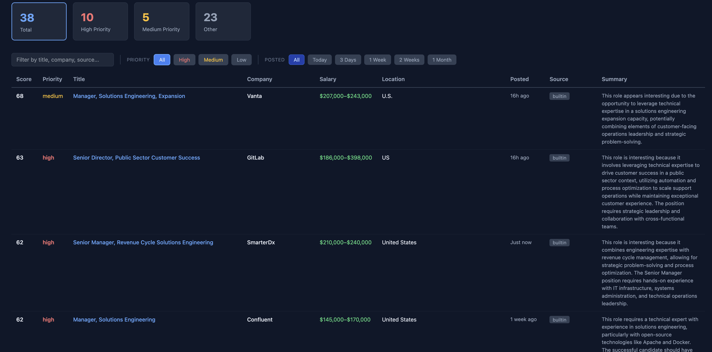
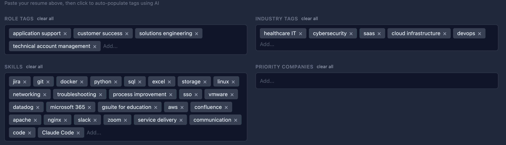
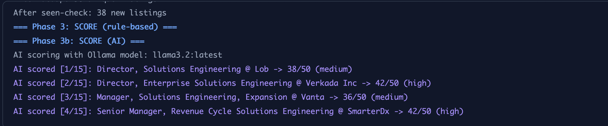

# AutoJobSearch

Automated daily job search pipeline that discovers, scores, and delivers relevant job listings. Runs locally with a browser-based dashboard or on GitHub Actions for daily automated searches.



## Features

- **Multi-source scraping** — Pulls listings from Greenhouse ATS boards, CrowdStrike (Workday), RemoteOK, BuiltIn, WeWorkRemotely, and LinkedIn via Google Alerts RSS
- **Smart filtering** — Filters by role keywords, location (US-wide remote or preferred city), salary floor, job age, and rejects junior/intern roles
- **Two-tier scoring** — Rule-based scoring (0-50 pts) on title match, company priority, industry keywords, salary, and skills alignment. Optional AI scoring (0-50 pts) via a local Ollama model for fit analysis
- **Resume-powered profile** — Upload a PDF/DOCX resume or paste resume text to auto-populate your search profile using AI
- **Interactive dashboard** — Filter by priority, search by keyword, sort by any column, and filter by posting date
- **Deduplication** — Fuzzy matching across sources + SQLite tracking of previously delivered listings
- **Daily automation** — GitHub Actions workflow runs weekday mornings and commits reports to the repo

## Quick Start

### 1. Clone and install

```bash
git clone https://github.com/your-username/autojobsearch.git
cd autojobsearch
python3 -m venv .venv && source .venv/bin/activate
pip install -r requirements.txt
```

### 2. Set up your profile

Copy the example profile and customize it:

```bash
cp profile.example.json profile.json
```

Edit `profile.json` with your own resume summary, role tags, skills, and salary range. Or skip this step and use the dashboard UI to build your profile (see below).

### 3. Install and configure Ollama

AI scoring and resume parsing require [Ollama](https://ollama.com) running locally. The pipeline works without it (rule-based scoring only), but AI features significantly improve result quality.

**Install Ollama:**

- **macOS:** `brew install ollama` or download from [ollama.com](https://ollama.com)
- **Linux:** `curl -fsSL https://ollama.com/install.sh | sh`
- **Windows:** Download the installer from [ollama.com](https://ollama.com)

**Download a model:**

```bash
ollama pull llama3.2
```

The pipeline defaults to `llama3.2:latest`. You can switch models at any time from the dashboard's model dropdown, or set the `OLLAMA_MODEL` environment variable.

**Recommended models:**

| Model | Size | Best for | Pull command |
|-------|------|----------|--------------|
| `llama3.2` | 2 GB | Default — fast scoring, good for daily runs | `ollama pull llama3.2` |
| `llama3.1:8b` | 4.7 GB | Better fit analysis and resume parsing | `ollama pull llama3.1:8b` |
| `mistral` | 4.1 GB | Strong at structured JSON output | `ollama pull mistral` |
| `llama3.1:70b` | 40 GB | Best quality, requires 48+ GB RAM | `ollama pull llama3.1:70b` |

Smaller models (3B and under) are faster but may produce less nuanced fit scores. Larger models give better analysis at the cost of speed — a 70B model can take 30-60 seconds per job vs 2-5 seconds for 3B. For daily automated runs, `llama3.2` is the sweet spot. For one-off deep analysis or resume parsing, pull a larger model and select it from the dashboard dropdown.

**Start Ollama:**

```bash
ollama serve
```

Ollama runs in the background on port 11434. Leave it running while using the dashboard.

**Important:** Install Ollama directly on your machine (not in a Docker container). The desktop install has direct access to your GPU, which makes scoring 10-50x faster. Running Ollama inside a container typically falls back to CPU-only inference, which can take minutes per job instead of seconds. If you're using the Docker setup for the dashboard, it's already configured to connect to Ollama on the host machine via `host.docker.internal`.

### 4. Start the dashboard

```bash
python main.py serve
```

This opens the dashboard at `http://localhost:8080` in your browser.

### 5. Build your profile from your resume

You have two options in the dashboard's Profile panel:

**Option A — Upload your resume file:**
1. Click **Upload Resume**
2. Select a PDF or DOCX file (max 10 MB)
3. The file is sent to your local Ollama model, which extracts role tags, industry tags, skills, and a professional summary
4. Review the auto-populated fields and adjust as needed

**Option B — Paste resume text:**
1. Paste your full resume text into the **Resume Summary** text box
2. Click **Analyze Text**
3. AI extracts the same structured tags from the pasted content
4. The summary field is replaced with a polished professional summary

Both options require Ollama running with a downloaded model (see step 3).



### 6. Run a search

Click **Run Search** in the dashboard. The pipeline will:

1. Query all configured job sources
2. Apply hard filters (role match, location, salary floor, job age)
3. Deduplicate across sources and against previously seen listings
4. Score matches using rule-based criteria
5. AI-score the top 15 results (if Ollama is available)
6. Display results in the dashboard

Progress streams live to the browser as each phase runs.



## Dashboard Guide

### Filtering results

**Priority filter** — Click the **High**, **Medium**, or **Low** buttons (or the stat cards at the top) to show only jobs at that priority level. Priority is determined by the combined rule-based + AI score.

**Search** — Type in the search box to filter by title, company, source, or any visible text.

**Posted date filter** — Filter jobs by how recently they were posted:

| Filter | Shows |
|--------|-------|
| All | Every job regardless of posting date |
| Today | Jobs posted within the last 24 hours |
| 3 Days | Jobs posted within the last 3 days |
| 1 Week | Jobs posted within the last 7 days |
| 2 Weeks | Jobs posted within the last 14 days |
| 1 Month | Jobs posted within the last 30 days |

These filters are based on the original posting date from the job source, not when the pipeline discovered the listing. Combine date filters with priority and search filters to narrow results further.

**Sorting** — Click any column header to sort. Click again to reverse.

### AI re-scoring

If Ollama is running, the dashboard loads available models in the dropdown. Select a model and click **Re-score with AI** to score the top 15 results against your profile directly from the browser. Scores update in-place and the table re-sorts automatically.

### Profile management

The Profile panel lets you edit all search parameters:

| Field | Purpose |
|-------|---------|
| Resume Summary | Your professional background, sent to the AI for fit scoring |
| Role Tags | Search keywords used to query job boards (e.g., "customer success", "technical account management") |
| Industry Tags | Keywords matched against job descriptions for industry relevance scoring |
| Skills | Your skills, matched against job descriptions for alignment scoring |
| Priority Companies | Companies that receive a scoring bonus |
| Salary Range | Min target, max target, and absolute floor for filtering |
| AI Prompt Template | Custom prompt template for AI scoring (uses `$resume_summary`, `$title`, `$company`, `$description`, `$salary_min`, `$salary_max`, `$location` placeholders) |

Changes are saved to your browser's local storage and to `profile.json` on the server.

## Job Sources

The pipeline searches six different job boards and aggregates the results. All sources are queried using your profile's role tags as search keywords.

| Source | How it works | What it covers |
|--------|-------------|----------------|
| **Greenhouse ATS** | Queries company job board APIs directly (JSON). No authentication required. | Add any company that uses Greenhouse by finding their board token from their careers URL (e.g., `boards.greenhouse.io/sentinellabs` → token is `sentinellabs`). Configure boards in `profile.json` under `greenhouse_boards`. |
| **CrowdStrike (Workday)** | Queries the Workday job search API used by CrowdStrike's careers site. Paginates through results 20 at a time. | CrowdStrike-specific roles. Deduplicates across pages automatically. |
| **RemoteOK** | Fetches the public JSON API at `remoteok.com`. | Remote-only positions across all companies. All listings are tagged as remote. |
| **BuiltIn** | Scrapes search result pages from `builtin.com`. Parses job cards for title, company, salary, and location. | US tech jobs across thousands of companies. Supports salary extraction in multiple formats. |
| **WeWorkRemotely** | Parses the RSS/XML feeds from `weworkremotely.com`. Titles arrive as `Company: Job Title`. | Remote jobs across programming, design, customer support, and more. |
| **LinkedIn (via Google Alerts)** | Reads Google Alerts RSS feeds configured to monitor LinkedIn job postings. Only includes entries from the last 24 hours. | Any LinkedIn job matching your alert keywords. Requires one-time manual setup (see [Adding LinkedIn alerts](#adding-linkedin-alerts)). |

Sources that were evaluated but aren't viable: **Indeed** (Cloudflare 403 blocks API access) and **Wellfound** (Cloudflare + DataDome anti-bot protection).

Each source module extends `BaseSource` with a `collect()` method that returns standardized `JobListing` objects. The `safe_collect()` wrapper catches exceptions so one source failure never kills the pipeline — the remaining sources still run.

## Seen Jobs and Past Results

Each time the pipeline runs, discovered jobs are stored in a local SQLite database (`seen_jobs.db`) to avoid showing the same listing twice. This means:

- **Jobs appear in search results only once.** After they're scored and delivered, they're marked as "seen" and won't show up in future runs.
- **Past results are preserved as dated reports.** Every pipeline run generates a timestamped HTML dashboard and markdown report in the `reports/` directory (e.g., `reports/2026-02-19.html`, `reports/2026-02-19.md`).
- **Access past results from the dashboard.** Click the **Past Results** button in the header to browse all previous search reports by date.
- **Reset to see all jobs again.** Delete `seen_jobs.db` to clear the history and re-discover all available listings on the next run.
- **Changing role tags auto-resets.** When you update your role tags in the profile and run a new search from the dashboard, the seen jobs database is automatically cleared so the new keywords get fresh results.

The database is lightweight (a few KB per run) and is gitignored by default. On GitHub Actions, it persists as a workflow artifact with 90-day retention.

## Headless pipeline

Run the pipeline without the dashboard to generate reports directly:

```bash
python main.py
```

This produces a markdown report and HTML dashboard in the `reports/` directory.

## Docker

```bash
docker compose up --build
```

The dashboard is available at `http://localhost:8080`. Ollama must be running on the host machine — the container connects via `host.docker.internal`.

## GitHub Actions

The included workflow (`.github/workflows/daily-job-search.yml`) runs the pipeline on weekday mornings and commits reports to the repo. AI scoring is skipped in CI since Ollama isn't available — jobs are scored with the rule-based system only.

To enable, push the repo to GitHub. The workflow runs automatically on the configured cron schedule or can be triggered manually from the Actions tab.

## Configuration

All search parameters are in `profile.json`. The example file (`profile.example.json`) documents the structure:

```json
{
  "resume_summary": "Your professional summary...",
  "role_tags": ["customer success", "technical account management"],
  "industry_tags": ["cybersecurity", "saas"],
  "skills": ["python", "jira", "sql"],
  "salary_range": { "min": 130000, "max": 0, "floor": 100000 },
  "priority_companies": [],
  "scoring": {
    "primary_role_tags": ["Customer Success Manager"],
    "secondary_role_tags": ["Solutions Engineer"]
  },
  "greenhouse_boards": {
    "CompanyName": "board-token"
  }
}
```

### Adding Greenhouse boards

Find a company's Greenhouse board token from their careers page URL (e.g., `https://boards.greenhouse.io/sentinellabs` → token is `sentinellabs`). Add it to the `greenhouse_boards` object in your profile.

### Adding LinkedIn alerts

1. Go to [Google Alerts](https://www.google.com/alerts)
2. Create an alert for `"customer success manager" site:linkedin.com/jobs`
3. Set delivery to **RSS feed**
4. Copy the feed URL into `sources/linkedin_alerts.py` → `ALERT_FEED_URLS`

## Architecture

```
main.py                    # Pipeline orchestrator + dashboard server
profile.json               # Your search profile (gitignored)
profile.example.json       # Template for new users

sources/
  greenhouse.py            # Greenhouse ATS JSON API
  crowdstrike.py           # CrowdStrike via Workday API
  remoteok.py              # RemoteOK JSON API
  builtin.py               # BuiltIn HTML scraping
  weworkremotely.py        # WeWorkRemotely RSS/XML
  linkedin_alerts.py       # LinkedIn via Google Alerts RSS

filters.py                 # Location, role, salary, age filters
dedup.py                   # Cross-source + historical deduplication
scorer.py                  # Rule-based scoring (0-50 pts)
ai_scorer.py               # Ollama AI scoring (0-50 pts)
resume_parser.py           # Resume upload → profile tag extraction
dashboard.py               # HTML dashboard generation
archive.py                 # Markdown report generation
config.py                  # Config loader from profile.json
user_profile.py            # Profile cache with thread safety

reports/                   # Generated dashboards and reports (gitignored)
```

## License

MIT
